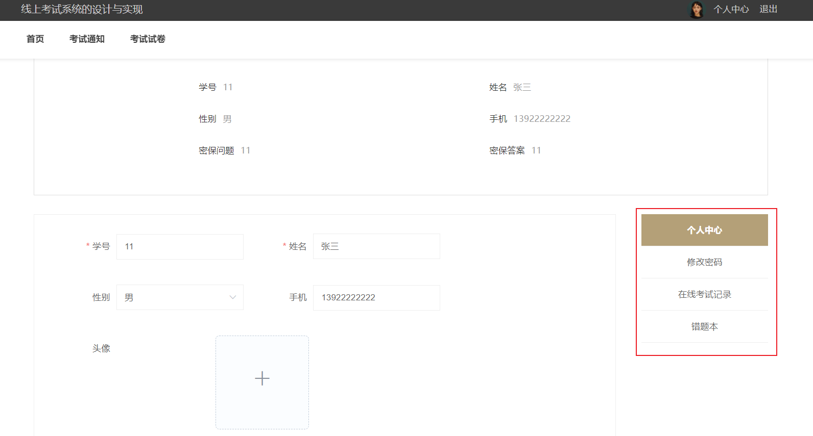

> 【**项目特色**】
>
> - 单选多选、判断填空、**主观题**
> - **错题本**、正确率
> - **QQ:3270728362**

## 简介

**基于SpringBoot的在线考试系统**

- 开发语言：Java
- 数据库：MySQL
- 技术：SpringBoot+MyBatis+Vue
- 工具：IDEA/Ecilpse、Navicat、Maven

---

## 系统展示

>首页

>考试列表

>在线考试

>个人中心

>管理员

> 教师界面

